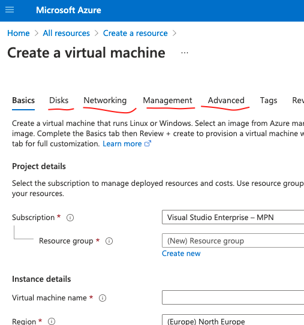
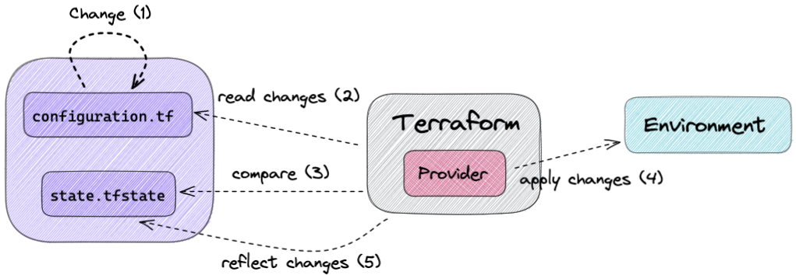
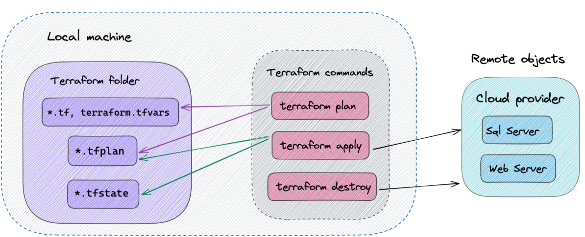

# Terraform playground

Terraform allows representing infrastructure as code. Or kinda code ... not like F# or C#, but more like _declarative configuration files_, like `json`, `yml` etc but with some support for functions, modules, etc. The language is called `HCL` - HashiCorp Configuration Language.

## What is infrastructure?

It is where your app and its individual parts live - virtual machines, networks, load balancers, db servers, message queues etc. With growing popularity of cloud providers like `Azure`, there have appeared certain new resources like web app, cosmos db, storage account etc.

A common way of managing infrastructure is manual intervention via some sort of GUI (all of us have at least once logged in to a production server to make a "small" change), writing custom configuration tools that setup everything specifically for your app etc. All of it can become error-prone, no one knows why a change to the environment has been made, why stuff just stopped working, which leads to hours of troubleshooting on the production servers.. fun stuff 😱

With modern cloud providers, manual configuration would be for example going to `https://portal.azure.com/` and clicking through the UI to create a virtual machine:


## Goal

- Reproducible infrastructure. Dev, stage, prod environments are consistent, easily reproduced and tested. Stop logging into your server and tweaking some settings or installing some software - you won't be able to reproduce it later and won't know why stuff broke.
- Manage infrastructure state in a **declarative** way. If you need to make changes to an existing configuration, you don't need to think about how to make or what's already present. Imperative way would look like this: if **X** is not installed - fetch it from **Y** and run the installation, if **Z** setting is not applied - install **A** and set the setting etc. You make a change in the configuration, specifying **what you want** and terraform will compare the current state and apply the change if necessary (sometimes recreating resources if the change is substantial).
- Increase automation. Apply infrastructure changes as part of the deployment process. Minimize human interaction.

## TL:DR;

You don't want to use GUI (or other configuration tool) to do infrastructure because:

- you can't track what changes are made overtime,
- you can't easily reproduce them elsewhere,
- you can't easily revert them if something goes boom 💥
- can't have it as a deployment step.

You want to use infrastructure as code to:

- track changes to the infrastructure in `git`,
- share and collaborate with others,
- recreate the same environment easily many times,
- revert changes easily if something goes wrong,
- make changes easily,
- automate changes to the infrastructure during deployment.

You tell `terraform` what the desired state of the infrastructure is and it will make it happen.

## How it works

You install `terraform` on your machine (fun fact - it is written in `Go`) and run `terraform` commands in a terminal.

You tell `terraform` what you want your environment to look like by writing your configuration in `.tf` files in some folder on your machine. The real state of the environment that corresponds to the configuration is tracked in a terraform state file and acts as a source of truth. When applying changes to the configuration, `terraform` will use the current state file to know what changes to make in the environment so that it matches the new configuration.

Do not bypass `terraform` by changing your environment via GUI or elsewhere, `terraform` state file won't match the actual configuration!



You run `terraform` commands in a terminal to apply changes to the configuration. Commands:

- `plan` - reads current state, compares to the configuration, creates a plan of changes (preview of the actions),
- `apply` - executed the action proposed in the plan on remote objects,
- `destroy` - delete all remote infrastructure for the configuration.



## Provider

`Terraform` can work with different cloud platforms - `Azure`, `Amazon`, `Digital Ocean`, etc. Code you write will differ depending on the cloud platform, since they usually have their own resources and rules for managing infrastructure specific for that platform.

`Terraform` itself is agnostic of the underlying platform, but for managing remote objects on that platform it needs to know how to interact with it - in other words how to call the platform's API to create/modify/delete resources. This is done via terraform plugins called providers.

### Usage with Azure

First of all, you need an `azure` subscription. You also need to install `Azure CLI` to authenticate into `azure` when running `terraform`. To login run:

```bash
az login
```
